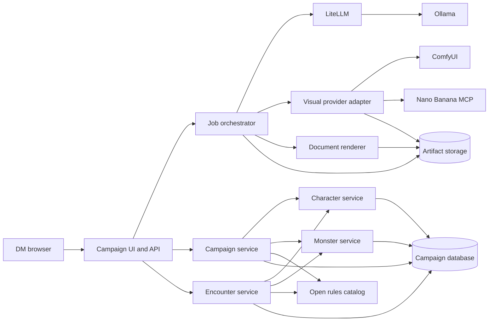

# D&D Tools Roadmap

## Product direction

D&D Tools will become a local-first assistant for dungeon masters to create,
prepare, run, and preserve campaigns. The application will coordinate a set of
small services in Kubernetes rather than embedding every capability in the web
process.

The target workflow is:

1. Create or import a campaign and its ruleset.
2. Generate and edit locations, characters, monsters, encounters, and handouts.
3. Produce consistent portraits, tokens, scenes, and battle maps.
4. Run encounters while tracking initiative, resources, conditions, and notes.
5. Feed session outcomes back into the campaign timeline and future plans.

This is a direction document, not a release schedule. Phases are ordered by
dependency and user value.

## Design principles

- **Local-first:** core campaign management must work without cloud services.
- **DM-controlled:** AI proposes structured drafts; the DM reviews and edits
  before material becomes campaign canon.
- **Portable data:** characters, monsters, encounters, and campaigns use
  versioned JSON schemas with import and export support.
- **Rules-aware:** calculations are deterministic code backed by licensed rules
  data, not guesses made by a language model.
- **Replaceable services:** models, image generators, rules catalogs, and
  renderers communicate through documented APIs.
- **Laptop-conscious:** CPU, RAM, GPU memory, and storage limits are explicit.
- **Content-safe:** only SRD, openly licensed, or user-provided rules content is
  distributed with the project.

## Target cluster architecture

The services are logical boundaries. Early phases may deploy related APIs from
one image while preserving these contracts. They should be split only when
independent scaling, dependencies, or failure isolation justify it.

## Planned services

| Service | Responsibility | Initial implementation |
|---|---|---|
| Campaign UI and API | DM workspace, editing, approvals, search, and orchestration | Existing FastAPI and HTMX application |
| Campaign service | Canonical campaign, location, faction, scene, timeline, and session records | Extend the existing database layer |
| Character service | Rules-aware PCs and NPCs, advancement, inventory, spells, and printable sheets | Native versioned schema with Open5e references |
| Monster service | Stat blocks, templates, CR checks, variants, and import/export | Native generator with 5e Monster Maker-compatible JSON where practical |
| Encounter service | Encounter building, difficulty budget, initiative, conditions, and live state | Deterministic rules engine and FastAPI endpoints |
| Rules catalog | Searchable open rules, monsters, spells, classes, and equipment | Self-hosted [Open5e API](https://github.com/open5e/open5e-api) |
| Job orchestrator | Durable AI and rendering jobs, retries, cancellation, and progress | Database-backed queue first; dedicated worker when needed |
| LLM gateway | Local and optional hosted text models | Existing LiteLLM and Ollama services |
| Visual service | Portraits, tokens, scenes, handouts, regional maps, and battle maps | Shared visual briefs routed to ComfyUI and Nano Banana Streamable HTTP MCP |
| Document renderer | Character sheets, stat blocks, encounter cards, and campaign books | HTML/PDF templates; evaluate [Homebrewery](https://github.com/naturalcrit/homebrewery) export |
| Artifact storage | Generated images, PDFs, source prompts, and exports | Existing persistent volume; S3-compatible interface later |

## Phase 0: Local campaign generation

**Status: Complete**

- Run D&D Tools, LiteLLM, and Ollama in a local kind cluster.
- Persist model files, campaigns, and generated artifacts.
- Generate structured campaign packs with locations, NPCs, scenes, decisions,
  handouts, draft maps, JSON, and PDF output.
- Provide health, inference, and end-to-end campaign acceptance checks.

**Exit criteria:** `task kind:acceptance` creates a campaign and downloads all
required artifacts.

## Phase 1: Stable content contracts

**Status: In progress**

- Completed: versioned character and monster JSON contracts with deterministic
  ability modifiers, proficiency, passive perception, attack bonus, and save DC.
- Completed: campaign-scoped persistence, creation forms, listings, and JSON
  export for characters and monsters.
- Remaining: editing, approval states, migrations, durable generation jobs,
  provenance, and complete import/export workflows.

- Define versioned schemas for campaigns, locations, characters, monsters,
  encounters, visual briefs, and artifacts.
- Validate all model output before persistence and show actionable validation
  errors to the DM.
- Add edit, approve, regenerate, archive, and export actions for generated
  content.
- Separate long-running generation from HTTP workers with durable job leases,
  cancellation, bounded retries, and restart recovery.
- Record model, prompt version, seed, source references, and parent artifact for
  reproducibility.
- Add database migrations and backup/restore commands.

**Exit criteria:** a pod restart cannot lose a queued job, and every generated
object can be edited and exported as schema-valid JSON.

## Phase 2: Rules catalog, characters, and monsters

**Status: In progress**

The first vertical slice provides manual character sheets and monster stat
blocks. Open5e import, advancement, full rules calculations, AI-assisted actor
drafting, CR analysis, and printable sheets remain planned.

### Rules catalog

- Deploy Open5e API as a CPU-only service.
- Search and import openly licensed monsters, spells, items, classes, and rules.
- Store source document, license, version, and canonical identifier with each
  imported record.
- Keep campaign overrides separate from catalog records.

### Character sheets

- Create PCs and NPCs from guided forms or a natural-language brief.
- Calculate ability modifiers, proficiency, saves, skills, armor class, hit
  points, spell slots, attacks, and passive scores deterministically.
- Support levels, multiclassing, equipment, spells, features, notes, portraits,
  and token references.
- Generate printable HTML/PDF sheets and versioned JSON.
- Import or export established open formats where licensing and schema stability
  permit it.

### Monster generation

- Generate a concept and structured stat block from role, environment, party
  level, desired difficulty, and theme.
- Calculate proficiency, saves, attacks, damage, defenses, and expected CR in
  code.
- Flag deviations from target offensive and defensive CR rather than silently
  changing creative choices.
- Create scalable variants, minions, elites, and legendary actions.
- Export JSON, Markdown, printable cards, and a 5e Monster Maker-compatible
  format where practical.

**Exit criteria:** the DM can import an open monster, create a variant, generate
a new monster, and place either into an encounter without re-entering data.

## Phase 3: Encounter preparation and live assistance

- Build encounters from party composition, location, objectives, and difficulty.
- Calculate encounter budgets and show the assumptions behind the result.
- Recommend terrain, hazards, tactics, reinforcements, rewards, and non-combat
  resolutions.
- Track initiative, hit points, temporary hit points, conditions, concentration,
  limited-use abilities, and round count.
- Provide DM-facing summaries without making player decisions or applying
  irreversible state changes automatically.
- Save encounter snapshots and convert outcomes into campaign events.
- Produce encounter packets containing stat blocks, maps, tokens, tactics, and
  treasure.

**Exit criteria:** an encounter can be prepared, run through multiple rounds,
paused, resumed after a pod restart, and committed to the campaign timeline.

## Phase 4: Visual production pipeline

- Completed: optional ComfyUI and Nano Banana providers can independently or
  jointly generate campaign location and scene images from shared briefs.
- Completed: Nano Banana runs as a discoverable Streamable HTTP MCP service
  with health probes, session negotiation, tool discovery, and inline image
  transfer.
- Completed: generated campaign images record provider, prompt, subject, and
  request settings; provider failures remain isolated warning artifacts.
- Add curated ComfyUI workflows for:
  - character and NPC portraits;
  - circular and transparent-background tokens;
  - monster illustrations and tokens;
  - location and scene illustrations;
  - regional, settlement, dungeon, and encounter maps;
  - item cards, letters, notices, and other player handouts.
- Store reusable visual briefs describing appearance, palette, clothing,
  heraldry, environment, and exclusions.
- Preserve workflow version, checkpoint, LoRA references, seed, dimensions, and
  prompt for every image.
- Generate related assets from the same brief to improve visual consistency.
- Add review states, variations, crop/upscale operations, and explicit approval.
- Add grid size, scale, walls, doors, lighting hints, and points of interest to
  battle-map metadata.
- Package approved maps and tokens for download or later VTT adapters.

**Exit criteria:** one approved character or monster brief can reproducibly
produce a portrait, token, encounter card, and map placement.

## Phase 5: Campaign operations and continuity

- Add campaign calendars, factions, quests, secrets, relationships, and event
  timelines.
- Capture session notes, attendance, decisions, discoveries, loot, and unresolved
  hooks.
- Generate a proposed post-session update as a reviewable diff against canon.
- Detect continuity conflicts and link claims to their source records.
- Search campaign canon and approved artifacts locally.
- Prepare session briefs containing likely scenes, relevant NPCs, encounters,
  maps, and unresolved decisions.
- Add player-safe views and exports that exclude DM secrets.

**Exit criteria:** a DM can prepare a session from existing canon, record what
happened, approve updates, and generate the next session brief without leaking
secret content.

## Phase 6: Packaging, reliability, and integrations

- Provide Kustomize overlays or a Helm chart for CPU-only, native Linux GPU, and
  optional cloud-model deployments.
- Add resource requests, health probes, network policies, secrets, and backup
  jobs for every stateful service.
- Add metrics for queue depth, generation duration, model errors, storage, and
  GPU memory pressure without recording private campaign text.
- Pin container images and automate upgrade compatibility checks.
- Add adapters for selected VTT and document formats without making a VTT a core
  dependency.
- Document disaster recovery and migration between laptops or clusters.

**Exit criteria:** a release can be installed, upgraded, backed up, restored,
and removed using documented commands without losing campaign data.

## Resource and scheduling plan

The reference development machine has an RTX 4070 Laptop GPU with 8 GB VRAM,
ample system RAM, and a high-core-count CPU.

- FastAPI, LiteLLM, the rules catalog, databases, and renderers remain CPU-only.
- Quantized 3B-8B language models are the default local model class.
- ComfyUI uses memory-conscious checkpoints and 512-768 pixel base resolutions.
- Ollama and ComfyUI do not run GPU inference concurrently on an 8 GB GPU.
- Native Linux GPU deployments use `nvidia.com/gpu`; Docker Desktop kind remains
  a CPU-compatible development profile until GPU passthrough is reliable.
- GPU jobs expose queue state so the DM can cancel or prioritize work.

## Cross-cutting requirements

### Data and licensing

- Ship only content whose license permits redistribution.
- Preserve attribution and source metadata through imports and derived content.
- Do not scrape or bundle proprietary rulebooks.
- Treat user-uploaded books and images as private campaign data.

### Security and privacy

- Keep local deployments usable without telemetry.
- Separate player-safe and DM-secret content at the data and API layers.
- Use Kubernetes Secrets for provider keys and never store keys in artifacts.
- Validate uploads, generated filenames, rendered markup, and imported JSON.

### Quality

- Unit-test deterministic rules calculations against published open examples.
- Contract-test every service API and schema migration.
- Maintain a small offline acceptance campaign covering text, rules, visuals,
  documents, encounter state, restart recovery, and export.
- Record provenance so generated material can be reproduced or audited.

## Near-term priority

The next implementation milestone is **Phase 1 followed by the smallest useful
slice of Phase 2**:

1. Introduce validated, versioned character and monster schemas.
2. Add Open5e lookup and import.
3. Build deterministic derived-stat and encounter-budget calculations.
4. Add editable character sheets and monster stat blocks.
5. Connect approved characters and monsters to a basic encounter builder.

This sequence establishes reliable game data before expanding AI generation or
visual workflows.
